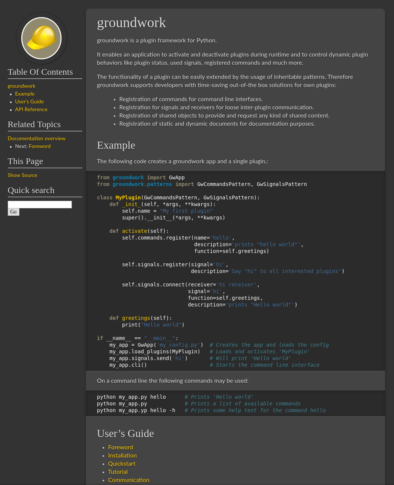

groundwork-sphinx-theme
=======================

This repository contains sphinx styles, which are use by most groundwork related projects.
It is a derivative of Kenneth Reitz's themes for his projects and of Mitsuhiko's themes for Flask and Flask related
projects.  To use this style in your Sphinx documentation, follow this guide:

1. Install the package using pip: ``pip install groundwork-sphinx-theme``

2. Add this to ``conf.py``:

   .. code-block:: python

       html_theme = 'groundwork'

Configuration
-------------
The groundwork-sphinx-theme provides the following configuration parameters:

 * **sidebar_width**: Allows the user to set the sidebar width in pixels. Good for deeply nested TOCs (Default: 220x)
 * **stickysidbar**: If True it makes the sidebar always visible if pages get longer (Default: True)
 * **stickysidbarscrollable**: Makes the sticky sidebar scrollable in small browser windows (Default: False)
 * **contribute**: If True, a contribute-area with github-buttons is shown inside the sidebar
 * **github_user**: Used the for github follow button. E.g.: useblocks
 * **github_fork**: Used for the github fork buttons. E.g.: useblocks/groundwork

You can change their value inside the file `conf.py` of your sphinx project::

    html_theme_options = {
        "sidebar_width": '240px',
        "stickysidebar": True,
        "stickysidebarscrollable": True,
        "contribute": True,
        "github_fork": "useblocks/groundwork",
        "github_user": "useblocks",
    }

Screenshot
----------

